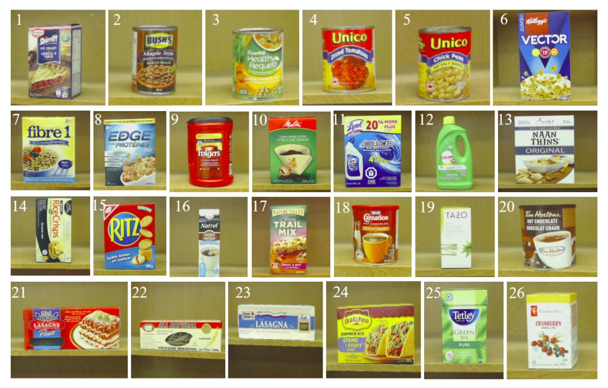
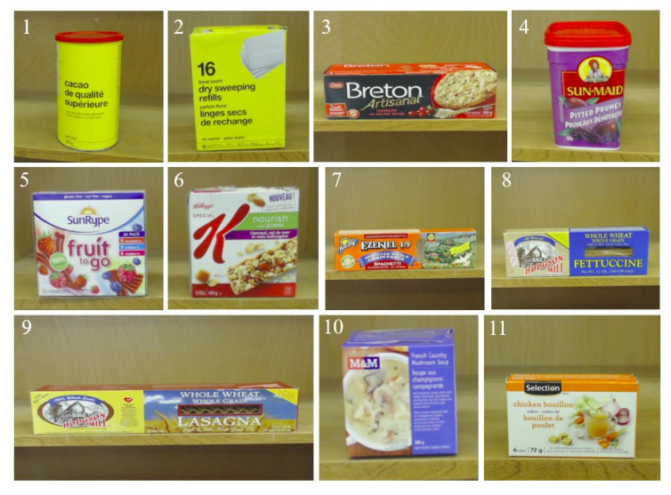

## Overview
This directory contains zip files corresponding to train, validation and test images that are used to train a product classifier.  Please create the following folders: train, val and test.

- train
  - Class 1/
  - Class 2/
- val
  - Class 1/
  - Class 2/
- test
  - Class 1/
  - Class 2/

Extract images in each zip file to their corresponding folder.

## Datasets
The datasets used to train and evaluate the product classifier were recorded on a webcam, where each image contained one or more products of the same class taken from various camera distances and orientations.

### Train / Validation
The trainval set consists of 260 initial images evenly distributed over 26 classes. The dataset’s size is further increased offline using data augmentation techniques such as including horizontal shifts, vertical shifts and shear
transformations. The final trainval size is 1300 images. These images are then divided into train and validation sets using a 70% / 30% split.

A summary of the classes found in the trainval set is shown below.

|Class Number| Product Name|
|------------|-------------|
|1|Shirrif Pie Crust|
|2|Bush's Baked Beans|
|3|Campbell's Chickpeas|
|4|Unico Diced Tomatoes|
|5|Unico Chickpeas|
|6|Vector|
|7|Fibre1|
|8|Edge|
|9|Folgers|
|10|Cone Coffee Filters|
|11|Lysol|
|12|Cascade|
|13|Naan Thins|
|14|Rice Crisps|
|15|Ritz Crackers|
|16|Natrel Light Cream|
|17|Nature Valley Trail Mix|
|18|Nestle Hot Chocolate|
|19|Tazo Green Tea|
|20|Tim Hortons Hot Chocolate|
|21|Etal Pasta Lasagna|
|22|All Natural Lasagna|
|23|Stop Shop Lasagna|
|24|Old El Paso Tacos|
|25|Tetley's Green Tea|
|26|President's Choice Cranberry Herbal Tea|

### Test
A separate test set is used to evaluate the trained product classifier. This test set consists of 110 evenly-distributed images from 11 classes not seen during training.

An overview of the test set's classes is shown below:

|Class Number| Product Name|
|------------|-------------|
|1|No Name Cacao|
|2|No Name Dry Sweeping Refills|
|3|Breton Cranberry Crackers|
|4|Sun-Maid Pitted Prunes|
|5|SunRype Fruit to Go|
|6|Kellog's Quinoa|
|7|Food Life Spaghetti|
|8|Hodgson Mill Fettuccine|
|9|Hodgson Mill Lasagna|
|10|M&M French Country Mushroom Soup|
|11|Selection Chicken Bouillon|

