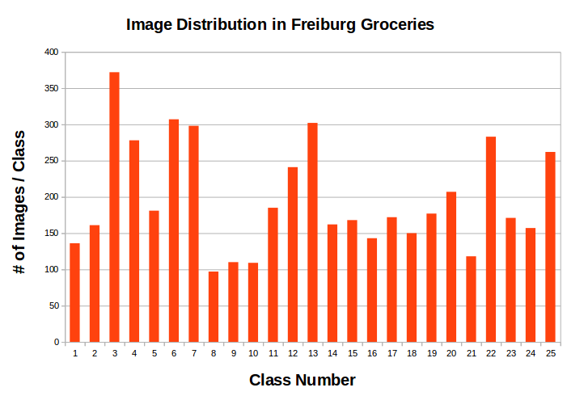

## Overview
Please read the following sections regarding the download, data augmentation and train/val/test splits of the dataset used for product category training.

Within this directory, please create the following folders: original, train, val, test.

The folders should be organised in this directory as follows:

- original
  - Class 1/
    - exp0001.png
    - exp0002.png
  - Class 2/
    - exp0001.png
    - exp0002.png
- train
   - Class 1/
   - Class 2/
- val
   - Class 1/
   - Class 2/
- test
   - Class 1/
   - Class 2/

## Freiburg Groceries Dataset
This dataset consists of approximately 5000 real-world images of grocery 25 store product categories (e.g. beans, cereal, rice, etc.) recorded on a mobile phone camera in Freiburg, Germany. The dataset is avaiable for download on the authors' [1] university website: http://aisdatasets.informatik.uni-freiburg.de/freiburg_groceries_dataset/

## Data Augmentation
The training examples in the original dataset are unevenly distributed over 25 classes corresponding to generic product
categories , with the number of training examples per class varying between 97 to 380.

Ideally, the dataset should have an equal distribution of images over all 25 classes. Data augmentation methods available in Keras' ImageDataGenerator library can be used to create an equal distribution. In this implementation, data augmentation methods such as horizontal shifts, vertical shifts and shear transformations are applied to images in each class, until a target number of 400 images / class is achieved. The final dataset size is 10,000 images.

## Train / Validation / Test Splits
The augmented original dataset is split into 70%/15%/15% train/val/test.

- train: 7000 images
- val: 1500 images
- test: 1500 images

The splits are created using the train_test_split module from sklearn's model_selection library. During this process, images are randomly shuffled before being assigned to the train, val or test sub-directories.
