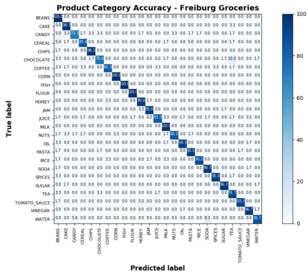
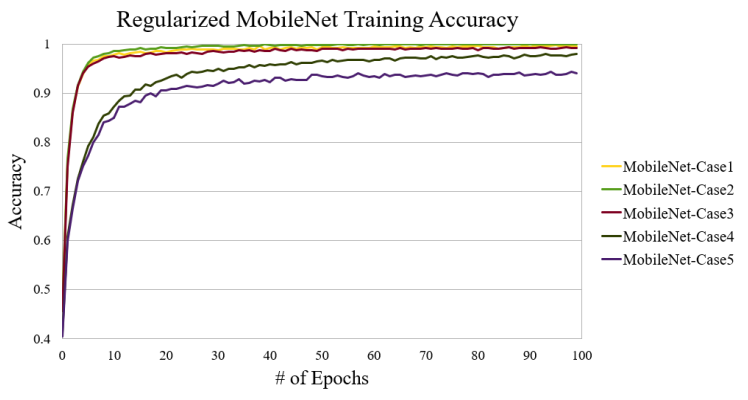
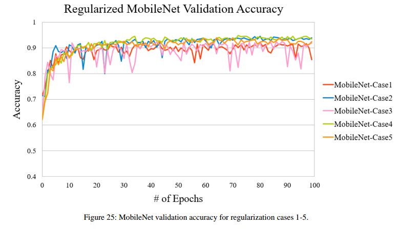

## Product Category Classification
On Freiburg Groceries, MobileNet achieved overall training, validation and test accuracies of 99.99%, 93.89% and 92.60% respectively. The accuracy per class on the test set is shown in the confusion matrix below.

The model had perfect classification accuracies of 100% for the categories beans, corn, fish, flour and milk, while its lowest accuracies corresponded to the candy (73.3%) and chocolate (75%) categories.

### Regularization Studies
Additional experiments were performed to explore how various regularization strategies affected the model's 
training and validation accuracies. In total, 5 methods were applied to the model:

|Case|Regularization Method(s)|
|----|-------------------------|
|1|No Regularization|
|2|L2 applied to softmax layer|
|3|L2 applied to FC + softmax layers|
|4|Dropout added before FC layers|
|5|Case 3 + Case 4|

For each case in the above table, new classifiers were trained with the specified regularization method. Training and validation accuracies for all 5 cases are shown below.

In Case 1, the model’s training accuracy converged to 100%, while its validation accuracy only achieved 85.5%. When L2 regularization was added to the softmax layer in Case 2, the model’s validation accuracy increased to approximately 94%, reducing the variance to approximately 6%. The addition of L2 regularization on the first FC layer did not affect the model’s variance significantly, with the training and validation accuracies decreasing to 99% and 92% respectively. The introduction of dropout in Case 4 resulted in the first substantial decrease in training accuracy from Case 2, while maintaining an equivalent validation accuracy of 94%. This effect was compounded further in Case 5, where dropout was combined with the previous L2 regularization in Case 3. The model’s overall variance was approximately 2%, however this improvement in variance was a result of the model’s training accuracy decreasing from 98% in Case 4 to 94% in Case 5. 

Overall, the results in Cases 1-5 demonstrate that while the model’s variance was improved
through the additional regularization in Cases 4 and 5, this came at the cost of a significantly decreased training accuracy.

## Product Classification
Four Siamese networks were trained using Inception-v3 [2], MobileNet [3], Inception-ResNet-v2[4] and ResNet50 base networks. Training and validation accuracy results are displayed in the two graphs below:

The choice of base network did not affect the Siamese network’s performance on the training and validation sets, as all four networks achieved 100% accuracies on both sets.

For the test set evaluation, each Siamese network was evaulated for 10 trials on randomly created subsets of the general test set, with each subset consisting of an equal number of similiar and dissimilar products pairs. The average test accuracy for the four base-network variants are reported in the following table: 

|Base Network|Average Test Set Accuracy|
|------------|-------------------------|
|Inception-v3|87.1%|
|MobileNet|87.5%|
|Inception-ResNet-v2|75.1%|
|ResNet50|86.5%|

Inception-v3, MobileNet and ResNet50 achieved similar average test set accuracies, with MobileNet having the highest average accuracy of 87.5%, while Inception-ResNet-v2 achieved the lowest test set accuracy of 75.1%. Overall, these results show that the MobileNet-based Siamese network marginally generalized better to new products not seen during training than its Inception-v3 and ResNet50 counterparts.
